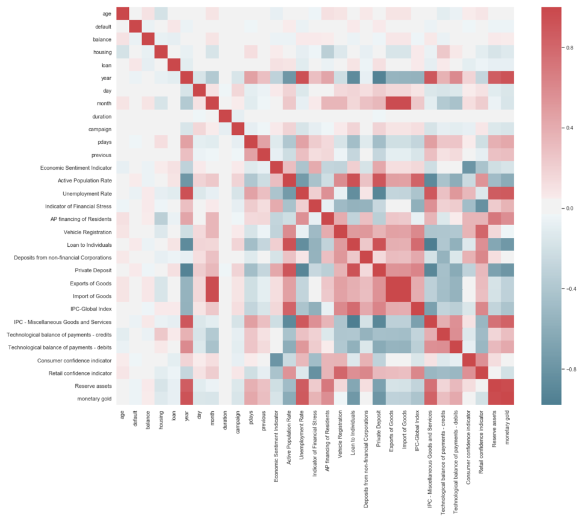
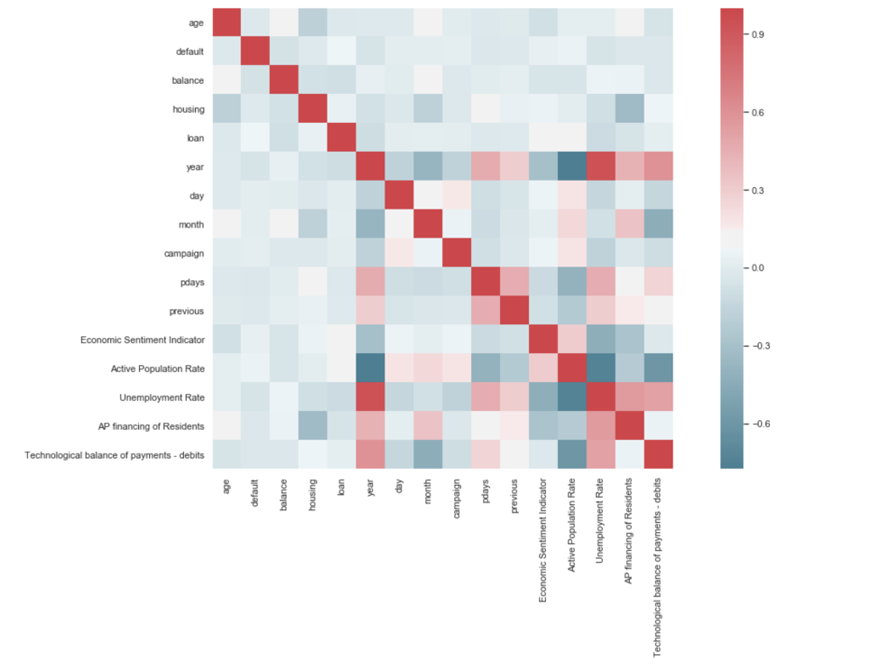
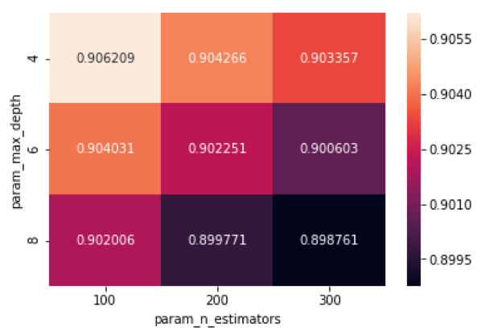
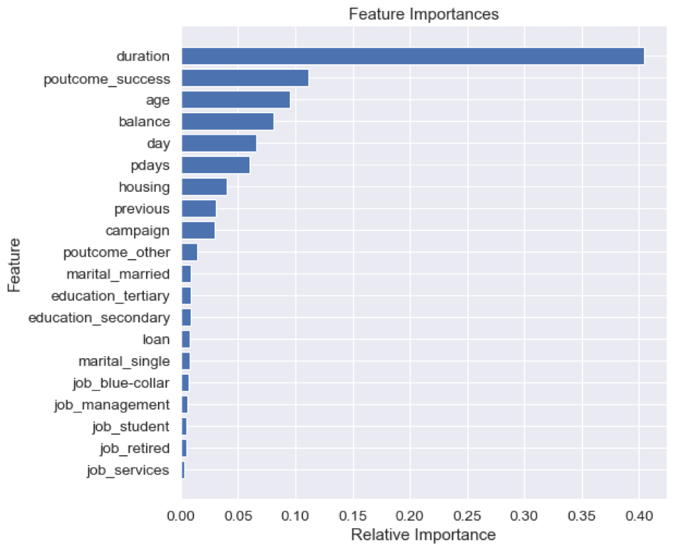
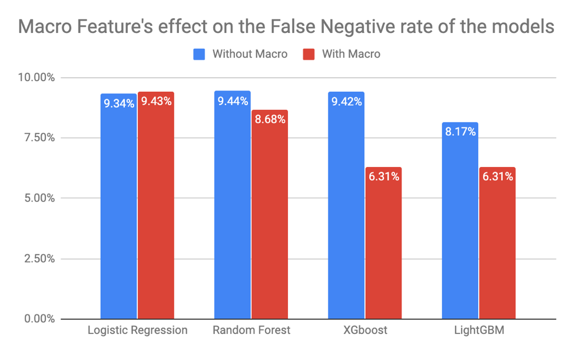
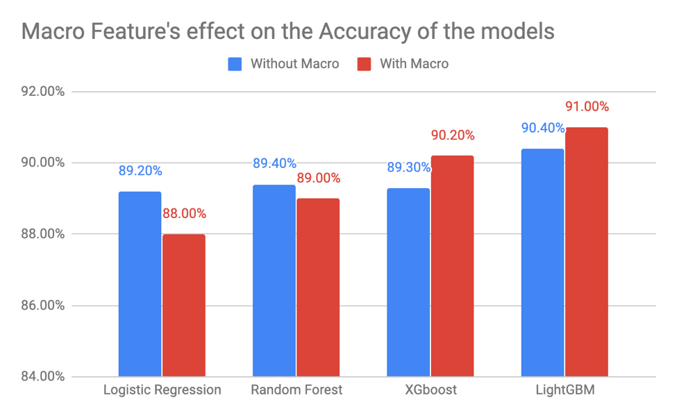
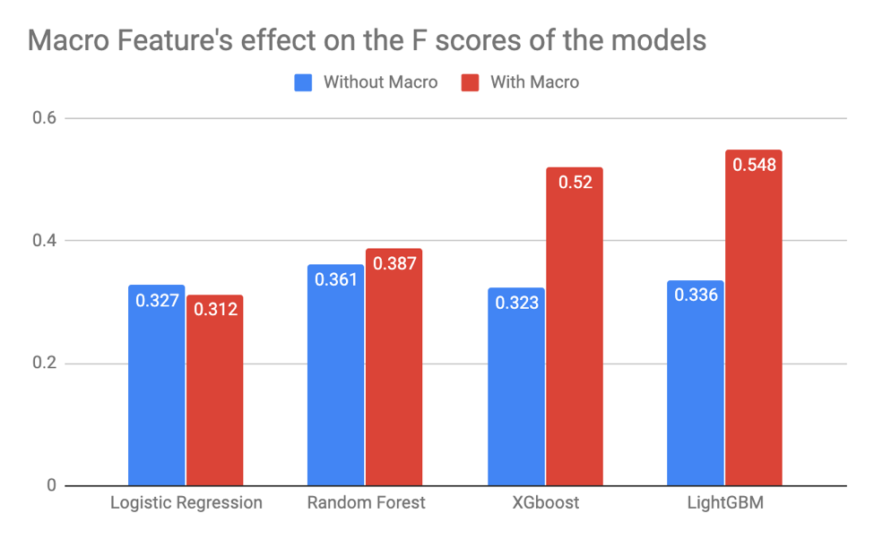

# Bank-Telemarketing-Campaign-Results-Classification

## Intruduction

Bank marketing campaigns offers a powerful and effective way for companies to introduce their products and build a connection with their customers.

Our study focused on a real dataset of 45,211 records which consists of direct marketing campaign information of a Portuguese banking institution. This dataset has its granularity at the personal level; each record contains the demographic information and statistics of the call, they are labeled with whether subscripted a term deposit with the banking institution.

The innovation of this study is to test the hypothesis ---- whether adding macroeconomic features, e.g. Economic Sentiment Indicator, Active Population Rate etc. to the overall dataset could improve the performance of the whole classification model. 

## Data Cleasing

The original dataset has missing values in several features. First, there are missing values labeled as ‘unknown’ in the ‘job’ column. Empirically and psychologically, people tend to be more reluctant to disclose their job status if they are unemployed. So imputing the missing values with ‘unemployed’ makes sense.

For the same reason, ‘primary’ is chosen as the imputation for missing values in the ‘education’ column. However, the situation is quite different for column ‘poutcome,’ which is the outcome of a previous marketing campaign. We cannot determine the outcome without any sound evidence, so we change the ‘unknown’ value, which represents missing values, to ‘other.’ We stick to the truth and regard it as missing values but change its name to ‘other’ to be distinguishable from missing values.

## Feature Engineering

The timeline of our original dataset starts from May 2008 to November 2010. We collected 19 macroeconomic variables by month from an official Portuguese economy website and joined the macro dataset with the raw dataset by month. The figure below is the pair correlation of the resulting dataset. 

Due to the high correlation, we apply a f_classif function to all the added macroeconomic variables and keep those with the highest score. f_classif is a function for the classification task. For each one of the variables, we applied one way ANOVA F-test and those features with high scores means. Finally, five of the added variables are kept and added to the raw dataset. Figure below shows the correlation of the selected five macroeconomic variables and features in the raw dataset. 

Finally, We transform the categorical variables to dummy variables with one hot encoder because empirically for tree models, dummy variables have a positive impact on the prediction metric. The variable ‘during’ is also ignored when building the model for its unique representation and effect on the final classification. 

## EDA

We explored the characteristics of each feature as well as the target. It is a dataset with weighted results, so we assume the boosting method may be the best for this dataset because boosting performs well for imbalanced dataset. However, we still use logistic regression as the baseline.

## Model

We apply logistic regression as the baseline and other models used include random forest, XGBoost and lightGBM.

GridSearchCV are used to tune the parameters of the models, below is an example of random forest:

The feature importance is as below:

## Performance Metrics

Confusion Matrix, Model Accuracy, F1-score

## Conclusion

LightGBM outperforms all the other models in all the performance metrics we choose and maintains good computing speed. LightGBM is very sensitive to the useful macroeconomic features we add and can turn the added features into its significant performance improvement. Those excellent features make LightGBM an ideal model in our predictions.

In this study, we propose a decision support system using machine learning approach for the selection of bank telemarketing clients. The goal is to model the success of making a long-term deposit using attributes that were known before making the call. We have placed a particular emphasis on feature engineering and have confirmed that macroeconomic indicators are of great significance in optimizing targeting in telemarketing.

In conclusion, our hypothesis is proved, and the added macroeconomic variables do make a substantial impact on machine learning models.

# Future Work

The goal of this model is to accurately predict the client behavior and discover the most critical impacts on successful term deposit. We improve the object further with macroeconomic data, and the final result proves that it works well. Neural Network could be used in the future to predict more accurately. What's more, it is meaningful find more hidden decisive relationships to making client subscript term deposit. With more dimensions of information in the future, we expect a more robust and interpretable model.

